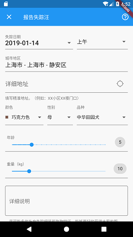
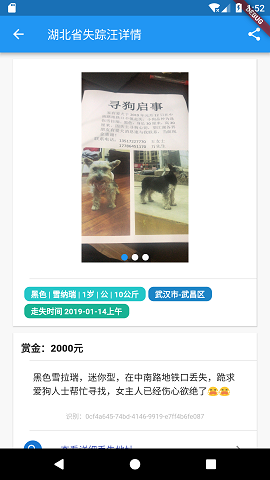
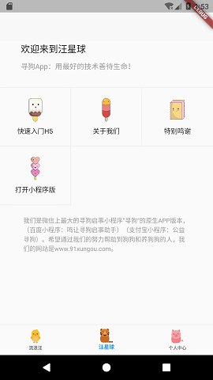

# 寻狗 Flutter 版

寻狗Flutter，是微信小程序“寻狗”的原生客户端版本，寻狗的[官方网站](https://www.91xungou.com/)。基于Flutter框架，使用Dart语言编制而成。本小程序全免费，公益无广告，专为寻狗启事，寻主启事，狗狗领养而设计，Flutter版本就是在此过程中开源产物，第一次写Flutter请多包涵。

   

# 提示

本代码使用GPL（GNU General Public License）许可协议开源，二进制版本已在Apple Store和Google Play以及国内各大Android市场上架，可以直接下载使用。

# 更新

原始代码写于0.9的Flutter，更新了gradle后，目前已经在最新的Dart 2.1和Flutter 1.1.9编译通过。

# Flutter快速入门

* 首先需要一个**Flutter**的环境，请移步[Flutter中文网](https://flutterchina.club/)，可能下载过程中需要点时间，但总体是傻瓜化操作。
* 官方网站阅读文档，
[官方documentation](https://flutter.io/)。

# 开发笔记

* 尽量保持了目录结构的整洁，lib下就是所有源代码，common存放了一些基础类包含了请求，基于jwt的登录校验，和一些常量等。
* 其中request.dart是基于dio的二次封装，登录态由login.dart负责，其实可以合二为一。
* screens目录放置了所有的页面级别元素，一个文件就是一个页面。
* models目录放置了viewmodel，单向的api转model方法，Dart的命名构造函数方式例如.fromJson的使用非常方便。
* utils目录里放了工具，一些校验类。
* widgets放置了私有控件，我写了一个图片上传控件方便上传图片。
* 使用了bottom navigation bar的布局方式，在main.dart中可以体现，是如何切换的。
* 为了保证ListView在切换tab中位置保持不变，使用了key来进行定位，可以参考/screens/lost/list.dart。
* 更新使用了Flutter 1.0以上版本，使用了google的webview控件，H5性能大幅提高，可以参考flutter 1.0的发布说明。
* 多语言的问题可以参考main.dart，里面将日历控件改成了中文展示。
* 微信分享利用了Fluwx控件，请在main.dart中fluwx.register改成你自己的appid。
* 地图使用了高德的HTTP接口，请在使用地图的http连接切换成你自己的key，在/screens/lost/map.dart中。
* 两个月前的代码了，想到什么再补充进来。

# Dart优点

* 路由非常的友好，使用起来很方便。
* 完整的异步语法支持。
* 可推导类型，当然还是建议用强类型。
* 整个Flutter框架并不是纯UI框架，而是谷歌的用户体验的最优化实践，可以做出非常华丽的动效。
* 有理由相信Google下一代Fuchsia将会是革命性的平台。
* 等等

# TODO
- [ ] 把高德http接口换成控件。
- [ ] 品类做到和寻狗小程序一样多。

# 其他

有问题可以放issue，谢谢，请支持寻狗小程序。

