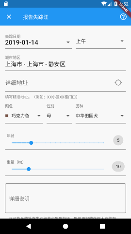
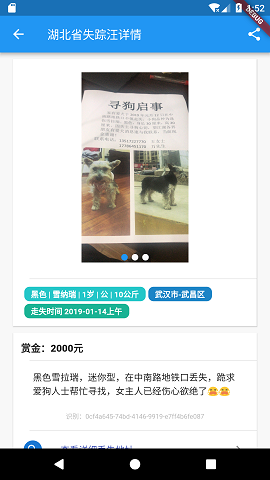

# 寻狗 Flutter 版

寻狗Flutter，是微信小程序“寻狗”的原生客户端版本，寻狗的[官方网站](https://www.91xungou.com/)。基于Flutter框架，使用Dart语言编制而成。本小程序全免费，公益无广告，专为寻狗启事，寻主启事，狗狗领养而设计，Flutter版本就是在此过程中开源产物，第一次写Flutter请多包涵。

   

# 提示

本代码使用GPL（GNU General Public License）许可协议开源，二进制版本已在Apple Store和Google Play以及国内各大Android市场上架，可以直接下载使用。

# 更新

## 2026-10：迁移到 Flutter 3.47.6 / Dart 3.13.5

原始代码写于 Flutter 0.9，此前只升过 Gradle。本次做了一次完整的现代化迁移。

**依赖**

| 包 | 旧 | 新 |
| --- | --- | --- |
| dio | ^2.1.0 | ^5.11.1 |
| flutter_picker | ^1.0.10 | 换成官方延续分支 flutter_picker_plus ^1.5.6 |
| flutter_swiper | ^1.1.6 | 换成 card_swiper ^3.0.1 |
| amap_base | ^0.3.4 | 删除（代码里从未 import） |
| path_provider | ^0.5.0+1 | 删除（无直接引用） |
| geolocator | ^5.x | ^14.1.1 |
| webview_flutter | ^0.3.x | ^4.14.1 |
| image_picker | ^0.6.x | ^1.2.4 |
| fluwx | ^1.x | ^6.0.5 |
| cached_network_image / intl / flutter_udid | 无 | ^4.0.4 / ^0.20.3 / ^4.1.6 |

> dio 4.0 存在 **CVE-2021-31402**（High severity）。升级到 dio 5.x 后该告警消失。

**代码**

* 全面启用 Dart 3 空安全：字段给初值、`required` 取代 `@required`、`late` 用于 initState 中赋值的字段。
* 弃用 API 替换：`RaisedButton`→`ElevatedButton`、`FlatButton`→`TextButton`、`OutlineButton`→`OutlinedButton`、`WillPopScope`→`PopScope`、`Form.onWillPop`→`canPop`+`onPopInvokedWithResult`、`WhitelistingTextInputFormatter`→`FilteringTextInputFormatter`、`AppBar.brightness`→`systemOverlayStyle`、`ScaffoldState.showSnackBar`→`ScaffoldMessenger`。
* 插件 API 适配：dio 5 的 `DioException`/`Duration` 超时/`FormData.fromMap`/`MultipartFile`；geolocator 的静态 API 与 `LocationSettings`；webview_flutter 4 的 `WebViewController`+`WebViewWidget`；image_picker 1.x 的实例方法 + `XFile`；fluwx 6 的 `Fluwx()` 实例 + `open(target: MiniProgram(...))`。
* 新增 `analysis_options.yaml`（flutter_lints 6）。

**平台配置**

* Android：AGP 3.2.1 → 9.1.0、Gradle 4.10.2 → 9.3.1、`jcenter()` → `mavenCentral()`、新增 `namespace`、compileSdk 28→36、minSdk 21→24、targetSdk 28→36、Java 17。`settings.gradle` 改用 Flutter Plugin Loader（旧写法依赖已被 Flutter 移除的 `.flutter-plugins`）；`MainActivity` 切到 v2 embedding；AndroidManifest 清掉 v1 残留并补 `exported` / `flutterEmbedding` / `NormalTheme`。
* iOS：Podfile 重写为 `flutter_ios_podfile_setup` + `flutter_install_all_ios_pods`；最低版本 iOS 8.0 → **15.0**（Flutter 3.47 要求）；`LSApplicationQueriesSchemes` 补齐 fluwx 6 要求的 4 个 scheme。
* `pubspec.yaml` 的 `version` 由 `1.0.0+1` 改为 `1.0.2+2`，与原先硬编码在 `android/app/build.gradle` 的 versionName/versionCode 对齐（现在以 pubspec 为唯一来源）。

### 迁移后需要人工确认的点

* **Android / iOS 的构建配置未经过真机构建验证**（开发机没有 JDK / Android SDK / Xcode），是按 Flutter 3.47 官方模板逐项对齐的，首次构建仍建议在本机跑一遍 `flutter build apk --debug` 和 `pod install`。
* **机型覆盖范围收窄**：Android minSdk 21 → 24（不再支持 Android 5/6），iOS 8 → 15。这是 Flutter 3.47 的硬性要求，无法保留。
* **微信 App ID 仍是占位符**：`lib/main.dart` 里 `registerApi(appId: "xxxxxxxxxxxxx")` 需要换成真实 App ID；iOS 侧还需要在 `Info.plist` 的 `CFBundleURLTypes` 里补一个 name 为 `weixin` 的 URL Type。
* **发布签名**：`android/key.properties` 不在仓库里（见 .gitignore）。现在没有该文件时会自动回退到 debug 签名，正式发版前需要补上。
* **iOS 版本号**仍硬编码在 `ios/Runner/Info.plist`（1.0.4 / 181218），没有改成 `$(FLUTTER_BUILD_NAME)`，以免上架版本号回退。
* **未采用新的 SceneDelegate 生命周期**：Flutter 3.47 的模板已改为 scene-based（`UISceneStoryboardFile` + `SceneDelegate`），本工程仍是 `main.m` + `AppDelegate.m` 的传统方式，暂时可用，后续 Flutter 强制要求时需要迁移。
* `lib/screens/planet/quick_start.dart`：原代码把 `javaScriptMode` 注释掉了（默认关闭 JS），而该 H5 页面是 React 单页应用，关闭 JS 必然白屏；本次已打开 JavaScript。

## 历史更新

原始代码写于 0.9 的 Flutter，更新了 gradle 后，在 Dart 2.1 和 Flutter 1.1.9 编译通过。

# Flutter快速入门

* 首先需要一个**Flutter**的环境，请移步[Flutter中文网](https://flutterchina.club/)，可能下载过程中需要点时间，但总体是傻瓜化操作。
* 官方网站阅读文档，
[官方documentation](https://flutter.io/)。

# 开发笔记

* 尽量保持了目录结构的整洁，lib下就是所有源代码，common存放了一些基础类包含了请求，基于jwt的登录校验，和一些常量等。
* 其中request.dart是基于dio的二次封装，登录态由login.dart负责，其实可以合二为一。
* screens目录放置了所有的页面级别元素，一个文件就是一个页面。
* models目录放置了viewmodel，单向的api转model方法，Dart的命名构造函数方式例如.fromJson的使用非常方便。
* utils目录里放了工具，一些校验类。
* widgets放置了私有控件，我写了一个图片上传控件方便上传图片。
* 使用了bottom navigation bar的布局方式，在main.dart中可以体现，是如何切换的。
* 为了保证ListView在切换tab中位置保持不变，使用了key来进行定位，可以参考/screens/lost/list.dart。
* 更新使用了Flutter 1.0以上版本，使用了google的webview控件，H5性能大幅提高，可以参考flutter 1.0的发布说明。
* 多语言的问题可以参考main.dart，里面将日历控件改成了中文展示。
* 微信分享利用了Fluwx控件，请在main.dart中fluwx.register改成你自己的appid。
* 地图使用了高德的HTTP接口，请在使用地图的http连接切换成你自己的key，在/screens/lost/map.dart中。
* 两个月前的代码了，想到什么再补充进来。

# Dart优点

* 路由非常的友好，使用起来很方便。
* 完整的异步语法支持。
* 可推导类型，当然还是建议用强类型。
* 整个Flutter框架并不是纯UI框架，而是谷歌的用户体验的最优化实践，可以做出非常华丽的动效。
* 有理由相信Google下一代Fuchsia将会是革命性的平台。
* 等等

# TODO
- [ ] 把高德http接口换成控件。
- [ ] 品类做到和寻狗小程序一样多。

# 其他

有问题可以放issue，谢谢，请支持寻狗小程序。

